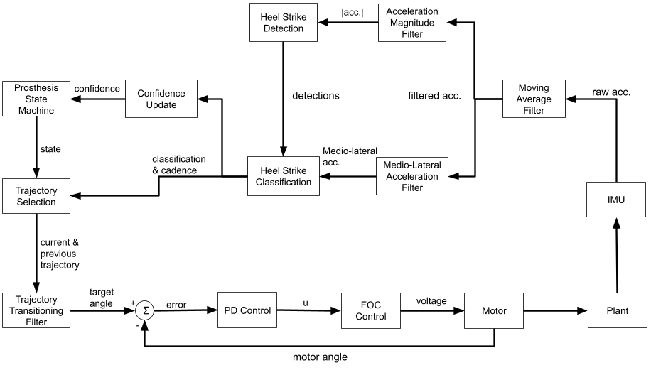

# NUControl — Prosthetic Arm Controller
* Michael Jenz
* 2026

Firmware for a Teensy 4.0-based controller that drives a brushless prosthetic arm during variable-speed walking. Uses IMU-based heel strike detection to identify gait phase and tracks a speed-dependent swing trajectory via FOC torque control.

## Hardware

| Component | Details |
|---|---|
| Microcontroller | Teensy 4.0 |
| Motor | GL40 brushless |
| Encoder | SPI absolute encoder (CS pin 10) |
| Current sensing | Inline sensors on Phase B (A3) and Phase C (A8) |
| Gate driver | 16V, 20kHz PWM, 12-bit resolution |
| IMU | LSM6DSV (SPI) |

## Control Architecture



Four timer-driven control loops run concurrently:

| Loop | Rate | Responsibility |
|---|---|---|
| `current_control_loop` | 10 kHz | FOC current control (torque) |
| `position_control_loop` | 1 kHz | PID position controller |
| `command_update_loop` | 100 Hz | Gait state machine, trajectory lookup |
| `imu_loop` | 1 kHz | Heel strike detection and classification |

### Gait State Machine

The IMU heel strike filter classifies each step as left or right and estimates the step period. Once classification confidence reaches 5, torque control is enabled. If confidence drops to 0 (e.g., the user stops walking), control is disabled and the arm returns to rest.

On each detected heel strike, a new swing trajectory is looked up from a LUT indexed by step period. Transitions between trajectories are smoothed using a blending term (`alpha`) that ramps from 0.1 to 1.0 over the course of the following step.

### Position Controller

A PID controller with optional gravity and spring feed-forward tracks the commanded trajectory angle. The torque output is clamped and sent to the FOC layer.

## Dependencies

- [TeensyTimerTool](https://github.com/luni64/TeensyTimerTool)
- [SPI](https://github.com/PaulStoffregen/SPI)

## Building

Requires [PlatformIO](https://platformio.org/). Open the project and build for `teensy40`:

```
pio run
pio run --target upload
```

Serial monitor runs at 115200 baud and streams telemetry in [Teleplot](https://github.com/nesnes/teleplot) format.
